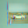

# 功能  
可视化模型参数变化，和对图像的影响
# 内容 

+ [x] 梯度类激活图GradCAM(single/batch 模式)  
  
+ [x] GradCAM++  
  
可视化区域比gradcam更精确，至少我是这么认为的，gradcam通过背景和车轮判断为ship，而plus主要通过车壳判断，而背景权重小一些。   
  
通过car与ship可以明显看出，根据图中车子外壳判断为ship，根据路面判断为car
+ [ ] 与训练相同的激活图  
+ [ ] 参数分布  
+ [ ] 神经元（滤波器） 
# 使用  
每个文件可直接运行
